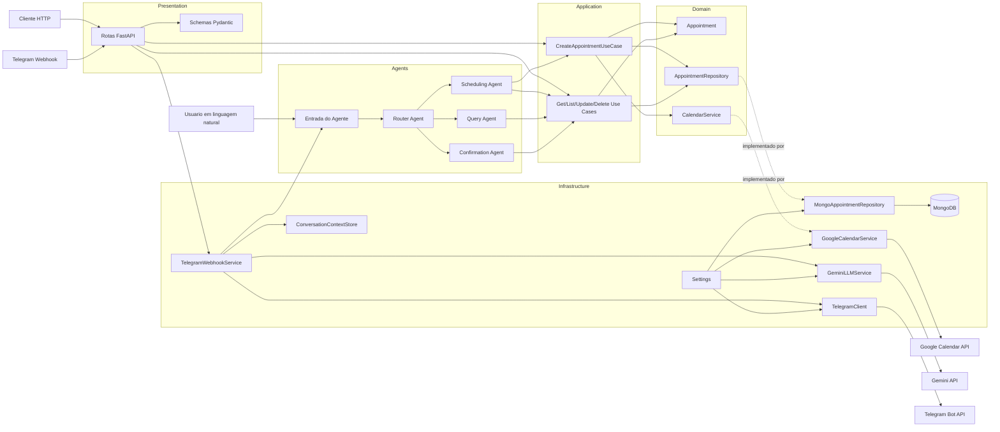

# lab-agenda

Micro-API backend em FastAPI organizada com Clean Architecture para evolucao incremental do projeto de agenda.

## Visao Geral

O projeto esta estruturado em camadas para separar responsabilidades de dominio, casos de uso, infraestrutura e apresentacao HTTP.

No estado atual, a aplicacao entrega:

- inicializacao basica do FastAPI
- fluxo assincrono na aplicacao e nos contratos principais
- endpoint de health check em `GET /health`
- CRUD de compromissos em `Appointment`
- agente de decisao com LangGraph para interpretar linguagem natural
- webhook de Telegram desacoplado da regra de negocio
- configuracao por variaveis de ambiente com Pydantic Settings
- logging centralizado
- integracao preparada com MongoDB usando Motor
- integracao com Google Calendar usando o cliente oficial da API Google
- integracao com Gemini para classificacao e resposta do assistente conversacional
- repository base generico e repository MongoDB para `Appointment`
- casos de uso assincronos para criar, buscar, listar, atualizar e deletar `Appointment`
- caso de uso para calcular horarios disponiveis da barbearia
- criacao de evento no Google Calendar ao criar compromisso, com persistencia de `event_id`
- testes automatizados com pytest, incluindo testes unitarios e integracao sem banco real

## Requisitos

- Python 3.11 ou superior
- Git

## Estrutura Do Projeto

```text
app/
	agents/
	domain/
		entities/
		interfaces/
	application/
		use_cases/
	infrastructure/
		config/
		database/
		logging/
		repositories/
		services/
	presentation/
		api/
			routes/
			schemas/
tests/
	unit/
```

## Camadas

- `domain`: entidades e contratos do negocio
- `application`: casos de uso e orquestracao
- `infrastructure`: configuracao, logging, conexao com MongoDB e implementacoes concretas
- `presentation`: rotas e schemas HTTP
- `agents`: grafo LangGraph e estrutura de decisao por linguagem natural
- `tests`: testes automatizados

## Arquitetura



## Modulo Appointment

O dominio `Appointment` foi introduzido com os campos:

- `id`
- `user_id`
- `datetime`
- `status`
- `notes`
- `event_id`

Status suportados:

- `scheduled`
- `confirmed`
- `canceled`

O projeto ja possui:

- interface `AppointmentRepository` na camada de dominio
- interface `CalendarService` na camada de dominio
- `MongoBaseRepository` generico na infraestrutura
- `MongoAppointmentRepository` como implementacao concreta
- `GoogleCalendarService` como adaptador da API externa
- casos de uso de criacao, busca, listagem, atualizacao e delecao na camada de aplicacao
- rotas HTTP com schemas Pydantic para request e response

Endpoints disponiveis para compromissos:

- `POST /appointments`
- `GET /appointments/{id}`
- `GET /appointments`
- `PUT /appointments/{id}`
- `DELETE /appointments/{id}`

## Agente LangGraph

O projeto possui um sistema multi-agente separado do FastAPI para interpretar linguagem natural e decidir a intencao relacionada a compromissos.

Agentes:

- `Router Agent`: decide a intencao e a rota do fluxo
- `Scheduling Agent`: trata criacao e atualizacao
- `Query Agent`: trata busca e listagem
- `Confirmation Agent`: trata confirmacao e cancelamento
- `GeminiLLMService`: classifica mensagens e gera a resposta final em portugues brasileiro

Fluxo do agente:

- entrada do usuario
- roteamento pelo `Router Agent`
- execucao pelo agente especializado
- delegacao para os casos de uso existentes

Saida do agente:

- intencao estruturada
- parametros extraidos da mensagem do usuario
- identificacao do agente responsavel pela decisao
- resposta final enviada ao Telegram com contexto por `user_id`

Hooks de logging foram adicionados antes e depois de cada no do grafo como preparacao para integracao futura com Langfuse.

O sistema multi-agente foi implementado de forma assincrona com LangGraph para evitar bloqueio do servidor em cenarios concorrentes e reutiliza os casos de uso existentes por meio de um executor separado.

## Configuracao De Ambiente

O projeto usa variaveis de ambiente carregadas de `.env`.

Arquivo de exemplo:

```env
APP_NAME=Lab Agenda API
APP_VERSION=0.1.0
APP_ENV=development
APP_HOST=0.0.0.0
APP_PORT=8000
LOG_LEVEL=INFO
APP_MONGODB_URI=mongodb://localhost:27017
APP_MONGODB_DB_NAME=lab_agenda
APP_GOOGLE_CALENDAR_ID=your-calendar-id@group.calendar.google.com
APP_GOOGLE_SERVICE_ACCOUNT_FILE=credentials/service-account.json
APP_TELEGRAM_BOT_TOKEN=your-telegram-bot-token
APP_TELEGRAM_API_BASE_URL=https://api.telegram.org
APP_GEMINI_API_KEY=your-gemini-api-key
APP_GEMINI_MODEL=gemini-2.5-flash
```

Para iniciar a configuracao local:

```bash
cp .env.example .env
```

## Instalacao

1. Crie o ambiente virtual:

```bash
python3 -m venv .venv
```

2. Ative o ambiente virtual:

```bash
source .venv/bin/activate
```

3. Instale as dependencias:

```bash
pip install -r requirements.txt
```

## Execucao

Para subir a API localmente:

```bash
uvicorn app.main:app --reload
```

Para recursos que dependem de persistencia MongoDB, mantenha uma instancia do MongoDB disponivel e configure `APP_MONGODB_URI` e `APP_MONGODB_DB_NAME` no `.env`.

Para a integracao com Google Calendar, configure `APP_GOOGLE_CALENDAR_ID` e `APP_GOOGLE_SERVICE_ACCOUNT_FILE` com as credenciais da conta de servico. As credenciais devem ficar fora do codigo-fonte e ser carregadas por variaveis de ambiente.

Para a integracao com Telegram, configure `APP_TELEGRAM_BOT_TOKEN` e `APP_TELEGRAM_API_BASE_URL`. O webhook recebe a mensagem, consulta o sistema multi-agente e envia a resposta de volta ao usuario pela Bot API.

Para a camada conversacional com Gemini, configure `APP_GEMINI_API_KEY` e `APP_GEMINI_MODEL`. O Gemini e usado para classificar a intencao da mensagem e gerar a resposta final do assistente.

Documentacao automatica:

- Swagger UI: `http://127.0.0.1:8000/docs`
- ReDoc: `http://127.0.0.1:8000/redoc`

## Webhook Do Telegram

Endpoint disponivel:

- `POST /telegram/webhook`

Fluxo:

- o Telegram entrega a mensagem no webhook do FastAPI
- a infraestrutura conversa com o Gemini para classificar a intencao e montar a resposta
- a mensagem e enviada ao sistema multi-agente para execucao dos casos de uso
- a resposta final e enviada ao usuario pela Bot API do Telegram

Contexto por usuario:

- o contexto conversacional e mantido por `user_id`
- referencias como "nesse dia" e "esse horario" podem reaproveitar a ultima data ou compromisso discutido

Exemplo:

```text
Usuario: Tenho horario amanha?
Assistente: Posso verificar os horarios livres de amanha para voce e sugerir os melhores horarios disponiveis.
```

Como testar localmente:

1. Terminal 1: iniciar a API com `uvicorn app.main:app --reload`
2. Terminal 2: iniciar o tunel com `cloudflared tunnel --url http://127.0.0.1:8000`
3. Terminal 3: registrar o webhook substituindo a URL publica

```bash
curl -X POST "https://api.telegram.org/bot$APP_TELEGRAM_BOT_TOKEN/setWebhook" \
	-H "Content-Type: application/json" \
	-d '{"url":"https://SUA-URL-PUBLICA/telegram/webhook"}'
```

4. Enviar uma mensagem para o bot no Telegram e acompanhar o processamento pelos logs da API

## Endpoint Disponivel

### Health Check

```http
GET /health
```

Resposta esperada:

```json
{
	"status": "ok",
	"service": "Lab Agenda API",
	"version": "0.1.0"
}
```

### Appointments

Exemplo de criacao:

```http
POST /appointments
```

```json
{
	"user_id": "user-123",
	"datetime": "2026-05-03T15:30:00Z",
	"status": "scheduled",
	"notes": "consulta inicial"
}
```

Ao criar um compromisso, a aplicacao cria um evento correspondente no Google Calendar e persiste o `event_id` retornado pela API.

O campo `datetime` deve incluir timezone e `status` aceita apenas:

- `scheduled`
- `confirmed`
- `canceled`

## Testes

Para executar os testes:

```bash
pytest
```

Testes unitarios do modulo `Appointment`:

```bash
pytest tests/unit/application
```

Esses testes usam mock de repository e nao acessam banco real.

Teste unitario do agente LangGraph:

```bash
pytest tests/unit/agents
```

Teste de integracao da API de compromissos:

```bash
pytest tests/integration
```

## Dependencias Principais

- FastAPI
- Uvicorn
- Pydantic
- Pydantic Settings
- Motor
- LangGraph
- Pytest

## Principios Adotados

- separacao clara entre regras de negocio e framework
- injecao de dependencia por funcoes de composicao
- contratos e casos de uso orientados a async
- repositories definidos no dominio e implementados na infraestrutura
- rotas sem regra de negocio
- base preparada para extensao sem acoplamento desnecessario
